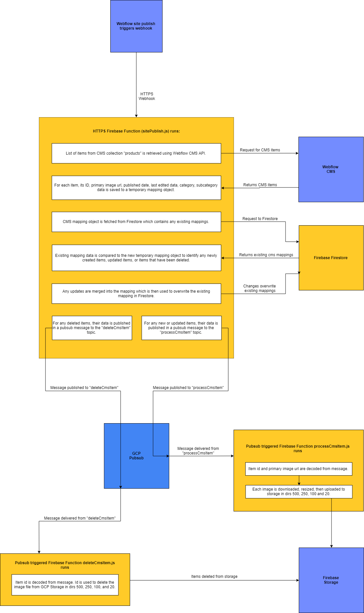

# Demuro Das

## Project Setup

### Development environment
1. Make sure to have Node.js and NPM installed.
2. Download or git clone this project to a local directory.
3. CD to `./functions` and npm install.

### Deploying changes
1. CD to `./functions`.
2. Run `npm run deploy-hosting`, `npm run deploy-functions`, or `npm run deploy-all` depending on what you would like to deploy. This is especially important for hosting as the deployment script runs minification and uncomments the files in `./pretty` and outputs them to `./public/scripts`.

### Workflow for deploying functions
1. Create a new branch from `master` by running `git checkout -b your-branch-name`
2. Modify the changes needed for your fix/feature, commit and push the changes to the remote branch
3. After you create the PR, and it's approved by the reviewer, merge the PR, and in your terminal checkout to `master` branch, pull the latest changes `git pull` and then run the deploy `firebase deploy --only functions` in the functions folder

This way the master branch always has the latest changes, and we deploy from it only, in order to have a history of deploys (since firebase doesn't), and we can roll back if we need to.

### Environment variables setup
The list of variables used:
mail.username
mail.password
oauth.clientid
oauth.clientsecret
oauth.refreshtoken

To set them up you need to run for each one of them: `firebase functions:config:set object.key=value`
When you want to get those variables you can run `firebase functions:config:get > .runtimeconfig.json`
In code you can access them as `functions.config().oauth.clientid`

### Project structure explained
```
project
│   .firebaserc //Default Firebase project is set here
│   .gitignore //Ignores node_modules
│   firebase.json //Default firebase deploy actions
│   readme.md
│
│
└───functions //Contains all serverless functions code
│   │   index.js //Entry point to serverless functions
│   │   package.json
│   │   package-lock.json
│   │   service-account.json //Used for pubsub auth as this is a GCP service
|   |   
│   │
│   └───main // Contains the high level functions declared in index.js
│   │   │   checkForApprovals.js
│   │   │   deleteFromStorage.js
│   │   │   getPrivateWfData.js
│   │   │   ...
│   │   │   ...
│   │
│   │
│   └───helpers //Smaller helper functions which are shared amongst the main functions
│   │   │   checkForDeletions.js
│   │   │   downloadImage.js
│   │   │   getPasswordResetLink.js
│   │   │   ...
│   │   │   ... 
│   │
│   │
│   └───emailBodies //Functions that return email bodies for various emails within the app
│   │   │   adminUserSignUpEmailBody.js
│   │   │   userSignUpEmailBody.js
│   │   │   userPasswordResetEmailBody.js
│   │   │   ...
│   │   │   ... 
│   │
│   │
│   └───utility //Used locally for getting Webflow CMS schema and items as necessary
│       │   webflowCms.js
│       │   items.json
│       │   schema.json
│   
│   
└───pretty //Unminified front end code written for clarity in es7
│   │   action.js
│   │   product.js
│   │   profile-settings.js
│   │   ...
│   │   ...
│   
│ 
└───public //Firebase Hosting folder
    |   
    │
    └───scripts // Contains the minified and uncommented scripts from /pretty
        │   action.js
        │   product.js
        │   profile-settings.js
        │   ...
        │   ...
```

## Tech stack

### Overview
```
+-----------------------+-------------------------+
| Front end development | Webflow                 |
+-----------------------+-------------------------+
| User authentication   | Firebase Authentication |
+-----------------------+-------------------------+
| Hosting               | Firebase Hosting        |
+-----------------------+-------------------------+
| Database              | Firebase Firestore      |
+-----------------------+-------------------------+
| Asset storage         | Firebase Storage        |
+-----------------------+-------------------------+
| Serverless functions  | Firebase Functions      |
+-----------------------+-------------------------+
| Event driven triggers | GCP Pub/Sub             |
+-----------------------+-------------------------+
```

## Front end
The front end is built entirely in Webflow. This site includes a small amount of custom JS and CSS which lives within the Webflow site pages head / footer code as well as the side wide head / footer code. The Webflow site is hosted using Webflow hosting.

Scripts that power the logic behind user registration, log in, profile changes, etc, are hosted using Firebase Hosting. These are included in the Webflow site using HTTPS script includes in the head / footer code embed sections of individual pages, as well as site wide where appropriate.

All custom scripts that are included in the site can be found in the `./pretty` directory of this project. They are served from `./public/scripts`, where they are placed after minification and uncommenting as part of this project's deployment process.

The main functionality provided on the front end is:
- User registration
- User log in
- User profile update
- Showing product pricing to authed users only
- Creating the dynamic masonry grids on the product collection pages

## Back end
All back end logic for this application is driven by Firebase Functions. These are triggered by a combination of HTTPS, user creation, user deletion, and GCP Pub/Sub triggers. You can see all serverless functions declared in `./functions/index.js`.

The main functionality provided on the front end is:
- Checking for newly approved user registrations
- Deleting images from Firebase Storage for which the corresponding Webflow CMS item has been deleted
- Loading private pricing data from the Webflow CMS
- Retrieving user information to send to the front end
- Retrieving CMS mapping to Firebase Storage data for displaying masonry grids on the product pages
- Resetting a user's password
- Signing up a new user by creating their account and creating a Firestore document with their UID
- Handling a Webflow site publish by checking for any new, updated or deleted Product CMS items
- Taking profile information updates from the front end
- Uploading CMS images to Firebase storage after appropriately reszing them for the masonry grids
- Handling user creation events by triggering emails to the admins and courtesy emails to the user
- Handling user deletion events by removing the user's Firestore document

## Masonry grid
The masonry grids displayed on the product page are created thanks to the [pig.js library](https://github.com/schlosser/pig.js/). For this to work, the same image must be accessible to `./public/scripts/pig.js` in directories named 500, 250, 100, and 20. The names correspond to the height of the image in pixels. For more information on how this works it's best to head over to the library and read about it.

For the purposes of this project, it's important to understand how the images are processed from the Webflow CMS and served up. The disagram below explains this:

